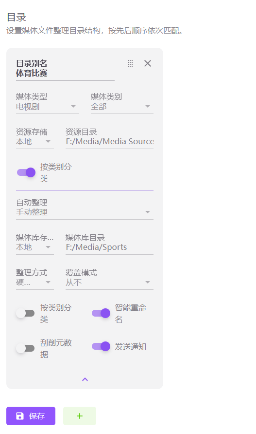
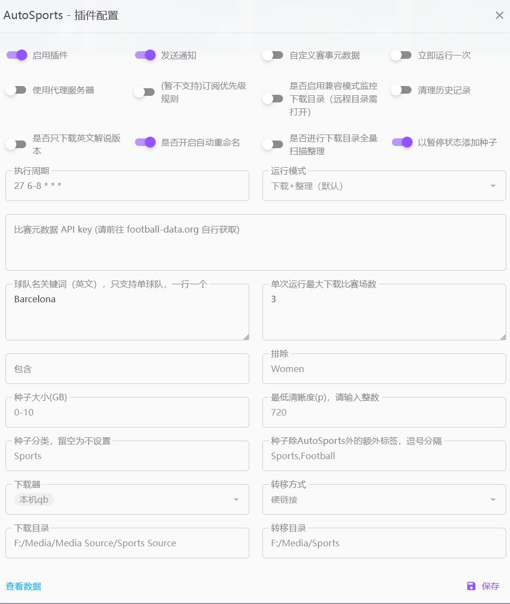

# MoviePilot-Plugins
MoviePilot官方插件市场：https://github.com/jxxghp/MoviePilot-Plugins

## 目录
- [1. Sportscult 比赛自动下载及简单刮削](#1-Sportscult 比赛自动下载及简单刮削)
- [2. ios快捷指令添加订阅修改版](#2-IOS快捷指令添加订阅修改版)
## 插件介绍
### 1. Sportscult 比赛自动下载及简单刮削
[插件目录](./plugins.v2/autosports)
  #### **如何使用**：
  1. 站点索引器：
     - 添加了 Sportscult 站点的索引器，安装此插件后即可使用，不需要启用该插件
     - 需要在站点 -> 添加站点中像其它站点一样填入相关信息
     - 直接搜索应该就可以搜到种子了
  2. 自动下载功能及整理刮削：
     > 该功能目前仍未经完备测试，请谨慎使用 
     > 
     > 目前支持西甲/欧冠/西班牙国王杯/西班牙超级杯，可以在插件内部添加对应的联赛识别器 (__competitions_parses) 以支持其它联赛
     
     1. 请前往 [football-data.org](https://www.football-data.org/client/register) 获取 API key
     2. 添加球队识别词
        ```
        Villareal => Villarreal
        Barcelona => FC Barcelona
        FC FC Barcelona => FC Barcelona
        ```
     3. 在 MP 设置中添加体育比赛的做种目录和媒体库目录，选项最好保持一致：
        
     4. 将获取到的 API key 填入插件设置中
     5. 将下载目录设置成做种的目录，转移目录设置为你的媒体库目录（与上面的最好相同或者是子集）
     6. 推荐目前最好使用下图这样的设置（球队名改成你的）：
        
  ___
#### 已知问题：
    1. 部分比赛可能无法被正确刮削，建议手动刮削
    2. 入库媒体刮削出来的季号好像不能是四位数，所以可能会有重复下载的情况，建议下载完后不要删除种子
  

### 2. IOS快捷指令添加订阅修改版
[插件目录](./plugins.v2/shortcutmodified)
  - 在[原作者](https://github.com/honue/MoviePilot-Plugins)的基础上做了现版本 MP 的适配
  - 添加了一些小功能，增强易读性
