## GistSyncCK

> Gist同步CK插件用于同步cookies，与[sync-my-cookie](https://github.com/Andiedie/sync-my-cookie)浏览器插件搭配使用；
>
> 与sync-my-cookie一致，使用[kevast.js](https://github.com/kevast/kevast.js)对内容加解密与[github gist](https://gist.github.com/)存储交换数据，只要加密密码不泄露无过需担心泄露内容问题；
> 要确保mp能正常访问github；
>
> 但因为使用js进行加解密，所以需要docker部署容器作为加解密的api端。

---

### 参数准备

插件需要参数

- GitHub token(gist)
  需要github账号
- password，加密密码
- gist ID
- gist 文件名，下面称为filename

#### password

可用密码生成器或Linux中的openssl命令等生成，尽量复杂

```bash
openssl rand -base64 14
```


#### Token

访问https://github.com/settings/tokens

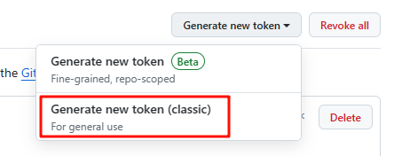

选择生成**classic token**

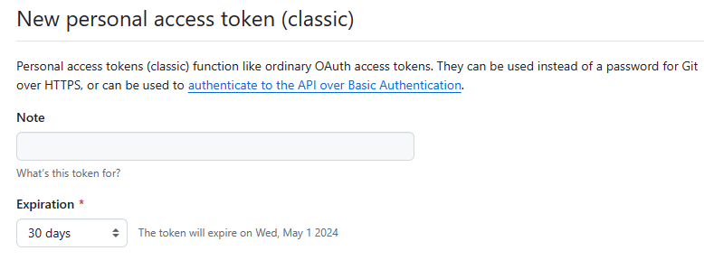

- Note：作为描述，随意填写，例如*gist_token*
- Expiration：该token过期日期，可指定时间或不过期

在**Select scopes**栏里勾选**gist**

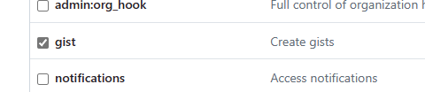

生成，保存好`token`（只显示一次）


#### 创建gist文件

可选择手动创建或浏览器插件自动创建，获取gist id和filename

##### 1. 手动创建

访问https://gist.github.com

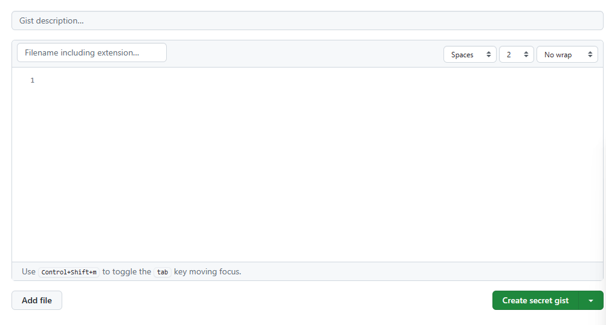

- description：描述该gist文件，可以随意填写

- Filename including extension：文件名（包含文件后缀），`filename`，例如

  ```
  kevast-gist-default.json
  ```

下面内容保持为`空`

**Create secret gist**
此处，public与secret gist，都能被访问，但secret是只有知道gist id才能访问到文件

创建后查看网址后面的字符串就是`gist id`

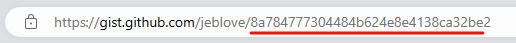

后续安装浏览器插件，并填入token、password、gist id、filename，保存


##### 2. 浏览器插件创建

访问[sync-my-cookie](https://github.com/Andiedie/sync-my-cookie)可看到[chrome web store](https://chrome.google.com/webstore/detail/syncmycookie/laapobniolmbhnkldepjnebendehhmmf)在线插件安装链接（chrome、edge），或可以下载crx、自己build，安装

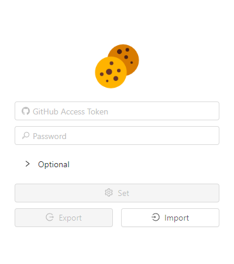

填入上面获得的token和password后点击**Set**

随后点击该插件的选项，展开Optional可看到`gist id`和`filename`
（或访问https://gist.github.com查看gists列表生成的gist文件）

可以找个网站点击**Push**，测试

（浏览器插件详细使用请移步到[sync-my-cookie](https://github.com/Andiedie/sync-my-cookie)查看文档）

---

### 部署docker端api服务器

可以直接拉取镜像运行或自己构建镜像

#### docker run

```bash
docker pull jeblove/gist-sync-api:latest
```

拉取镜像

```bash
docker run
  -d
  --name='gist-sync-api'
  -p '9300:9300/tcp' 'jeblove/gist-sync-api:latest'
```

默认端口为9300


#### Dockerfile

```bash
git clone https://github.com/jeblove/gist-sync-api.git
cd gist-sync-api
docker build -t gist-sync-api .
```

然后部署自己构建镜像的容器


启动容器

---

### 使用

mp中安装插件

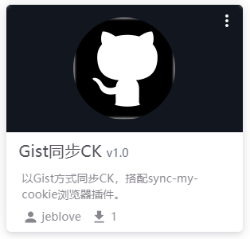

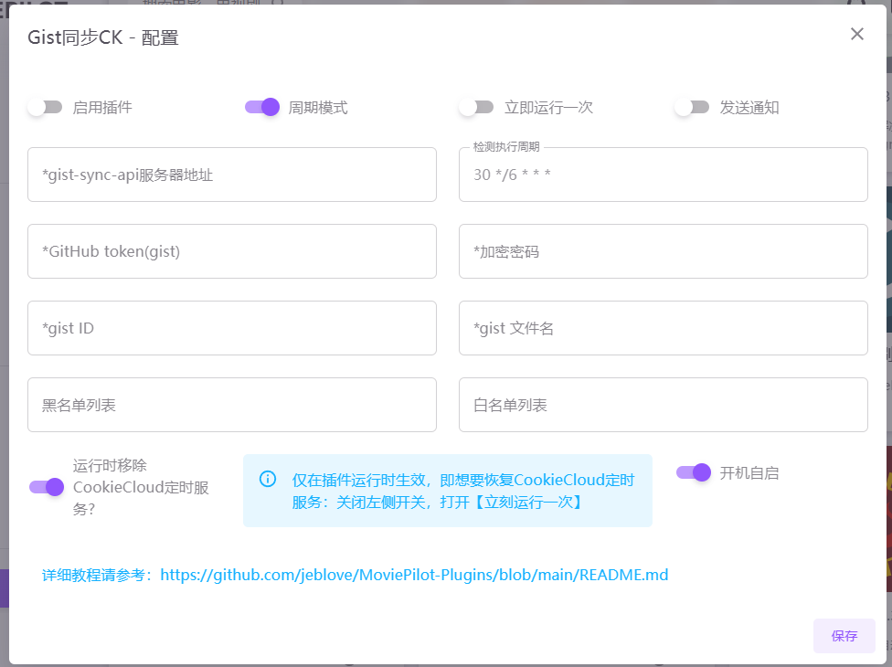

先填入必要参数

- api服务器地址：容器链接，*http://192.168.100.111:9300*
  如果mp与api服务器容器都处于同一docker网络类型（例如bridge）可以直接使用该网络的网关地址，端口就是容器内部端口*http://172.17.0.1:9300*

- token
- password
- gist id
- gist 文件名

当前版本黑白名单暂未支持，请忽略

开关解释：

- **周期模式**：按照cron运行同步

- **运行时移除CookieCloud定时服务?**：

  - 开，当Gist同步CK运行同步时，如果检测到CookieCloud定时服务存在则会移除
  - 关：恢复CookieCloud定时服务

  注意：是当该插件运行时才会触发

- **开启自启**：mp启动后会执行一次同步
  可搭配移除CookieCloud定时服务使用，这样就等于接管了Cookie同步

- **发送通知**：同步结束后，无论正常同步还是同步异常都会发送通知
  注意：当站点无需同步时，消息会显示“更新了0站点”


#### 开启并关闭CookieCloud

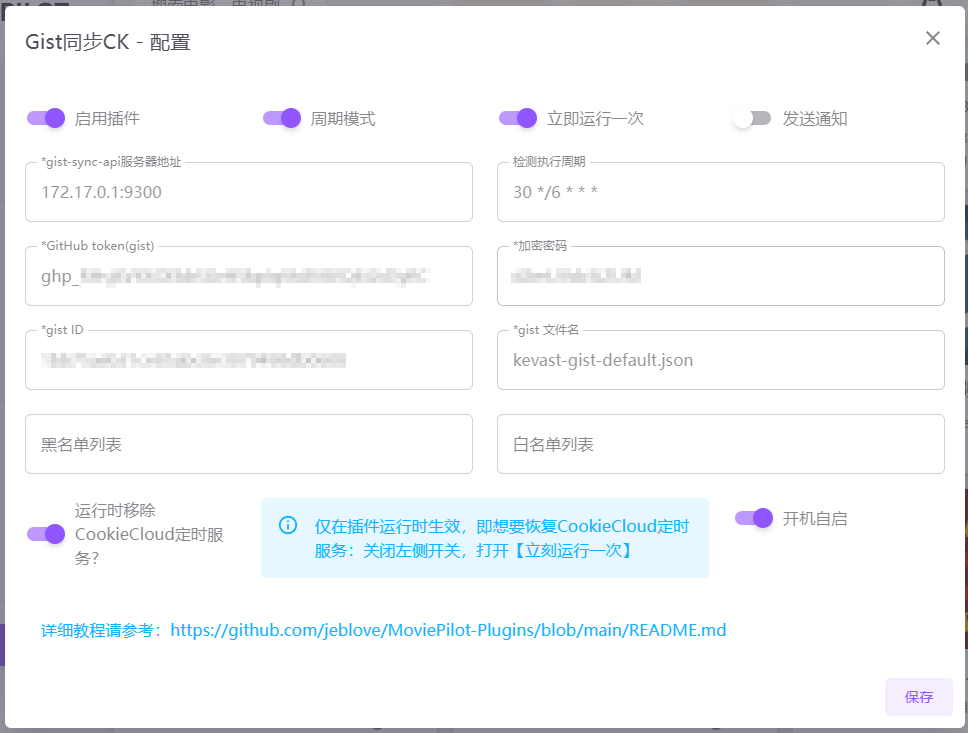

例如，我当前的开关就是为了停止CookieCloud，只使用Gist同步CK。
开启运行一次，保存

查看插件日志

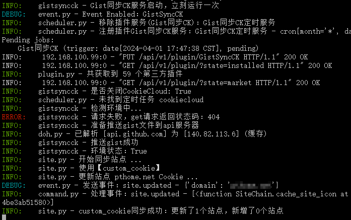

正常同步
（这里的404无需担心，只是因为初次同步，api服务器中没有缓存文件）


可以到设定-服务

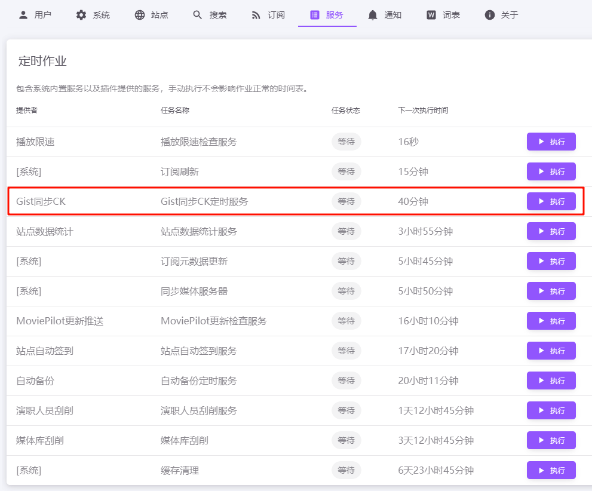

Gist同步CK已经存在定时任务中，并且CookieCloud移除定时任务了


#### 恢复CookieCloud

想要恢复CookieCloud定时任务也很简单

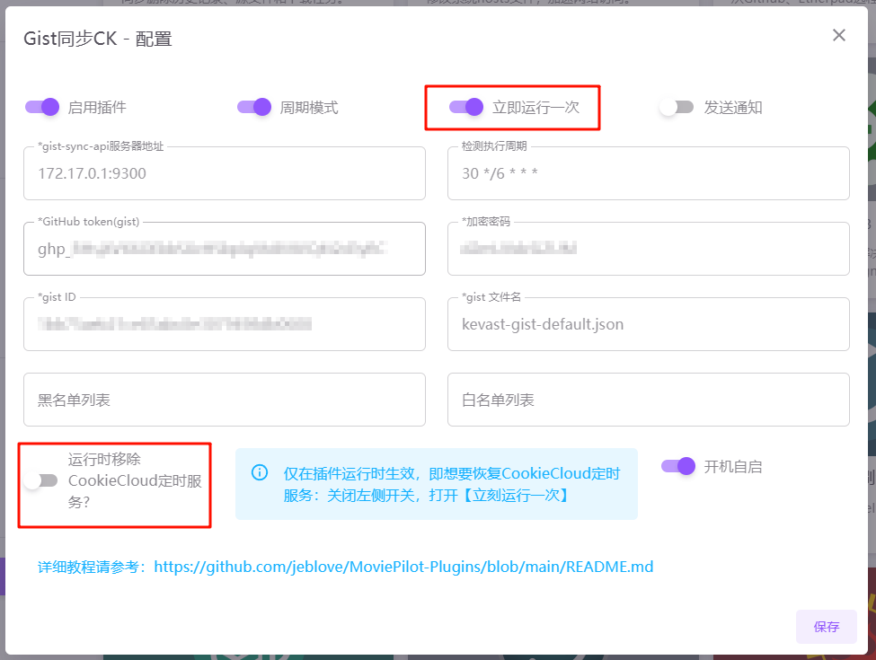

关闭“**运行时移除CookieCloud定时服务?**”，开启运行一次，保存

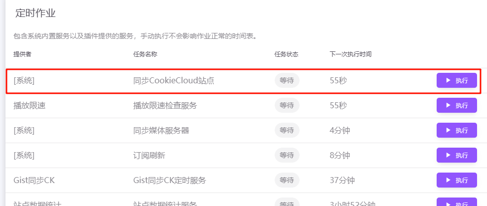

可以看到，恢复了
（不建议两个CK同步服务同时开启使用）


完成